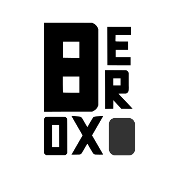

# Boxer Typeface

**Boxer** is a bold, geometric sans-serif typeface designed with strong rectangular forms and sharp angles. Its rugged and futuristic look makes it perfect for headlines, branding, posters, UI design, and gaming projects.

---

## Font Information

- **Name:** Boxer
- **Style:** Bold, Geometric, Display
- **Format:** `.ttf` / `.otf`
- **Designer:** Rakesh Kanna
- **License:** Free for personal [MIT](LICENSE)

---

## Features

- Full uppercase A–Z characters
- Strong industrial and modern appearance
- Highly legible at large sizes
- Ideal for logos, headlines, posters, and web projects

---

## Preview

  

---

## Downloads
- [Boxer Regular (ZIP)](./Boxer-Regular.zip)

---

## Usage

You can install the font by:
1. Download the [ZIP file](./Boxer-Regular.zip)
2. Unzip the file and place the `.ttf` or `.otf` file in your font folder
3. Double-click on the font file and click **install** to install the font

Use it in any design software like Figma, Photoshop, Illustrator, or directly in your web projects!

---

## License

This font is free for **personal** use.  
[MIT License](LICENSE)

---

## Contact

If you use Boxer in a project, I'd love to see it!  
Feel free to share your creations or reach out:

- Website: [rakeshkanna-rk.github.io](https://rakeshkanna-rk.github.io/)
- Email: [rakeshkana0108@gmail.com](mailto:rakeshkana0108@gmail.com)
