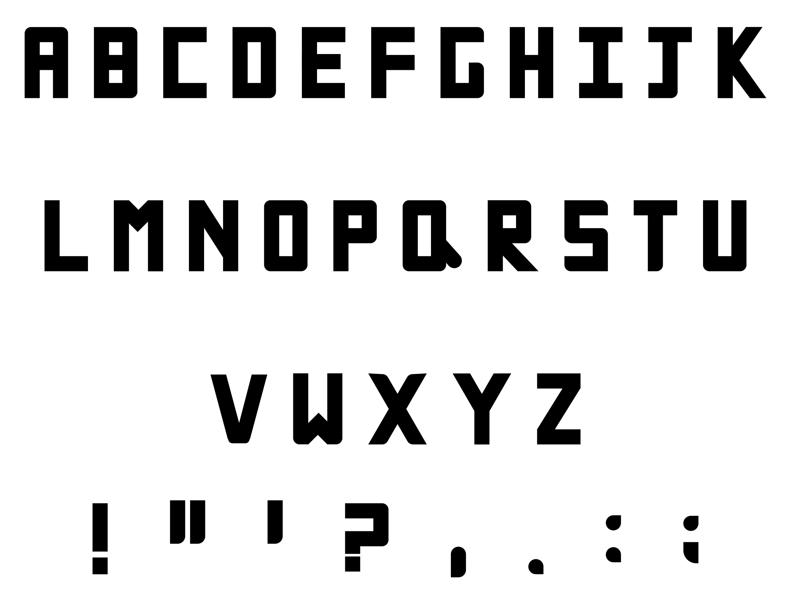

# Boxer Typeface

**Boxer** is a bold, geometric sans-serif typeface designed with strong rectangular forms and sharp angles. Its rugged and futuristic look makes it perfect for headlines, branding, posters, UI design, and gaming projects.

---

## Font Information

- **Name:** Boxer
- **Style:** Bold, Geometric, Display
- **Format:** `.ttf` / `.otf`
- **Designer:** Rakesh Kanna
- **License:** Free for personal [MIT](LICENSE)

---

## Features

- Full uppercase A–Z characters
- Strong industrial and modern appearance
- Highly legible at large sizes
- Ideal for logos, headlines, posters, and web projects

---

## Preview

  
*(Replace this with a real preview if you want.)*

---

## Usage

You can install the font by:
1. Downloading the font file (`Boxer.ttf` or `Boxer.otf`).
2. Double-clicking the file and clicking **Install**.

Use it in any design software like Figma, Photoshop, Illustrator, or directly in your web projects!

---

## License

This font is free for **personal and commercial** use.  
*(Or you can write a custom license if you want like "You cannot resell it" etc.)*

---

## Contact

If you use Boxer in a project, I'd love to see it!  
Feel free to share your creations or reach out:

- Website: [Your website or portfolio link]
- Email: [your.email@example.com]
- Instagram: [@yourhandle]
